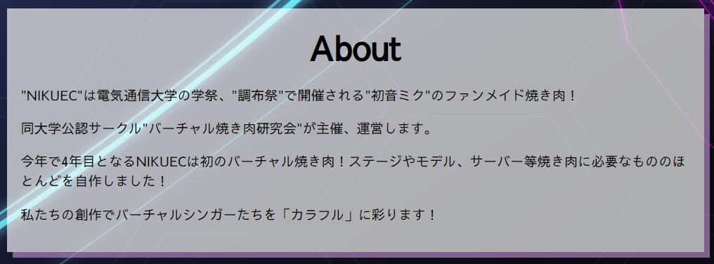
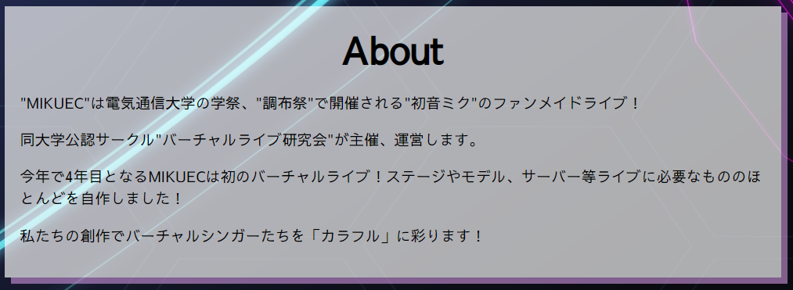

# NIKUECコンバーター

任意のページの「MIKUEC」についての話を「NIKUEC」の話にしてしまうChrome拡張機能です．

## 目的

11/21に開催された[MIKUEC2020](https://mikuec.com/2020/)(ボカロのライブ)においてMCのネタとして登場したパワーワード，それが__NIKUEC__です．ちなみに初出は初代代表の[渾身のネタ](https://twitter.com/yuzu_movie_39/status/1148244704531628033?s=20)らしいです．

ともかく，このVLLの一大焼き肉イベントである__NIKUEC__で一大ライブイベントMIKUECを侵食してみたかったというのが動機であり，目的です．

## 使い方

+ NIKUECerフォルダを適当にダウンロード

+ Chrome拡張機能のページ(chrome://extensions/)を開く

+ 右上のデベロッパーモードのトグルをオンにする

+ 左上の「パッケージ化されていない拡張機能を読み込む」からNIKUECerを選択して読み込む

以上で拡張機能"MIKUEC"と書いてあるサイト(https://mikuec.com/2020/ とか)を開くと，冒頭の画像のようになります．ちなみにもとのサイトはこうなってます．

## 仕組み

正規表現で

+ MIKUEC → NIKUEC
+ みくえっく → にくえっく
+ ライブ → 焼き肉

と置き換えてるだけで，ほとんど参考サイトのコピペみたいなものです．

##既知の問題

めっちゃMIKUECが良すぎてぶち壊し感が半端ないという問題が(ステマ)

次回は(も)来てね！！！(ダイマ)

####  既知の問題

+ TwitterとTweetDeckで有効にならなくなったりする

  TweetDeckは何かAdd columnしてからリロードすればいけるかも

  Twitterはわからない

## 参考

+ [Chrome拡張の作り方 (超概要)](https://qiita.com/RyBB/items/32b2a7b879f21b3edefc#%E3%82%B3%E3%83%BC%E3%83%89-1)
+ [Chrome 拡張機能を作ろう実践編](http://www2.kobe-u.ac.jp/~tnishida/programming/ChromeExtension-02.html#regexp)

